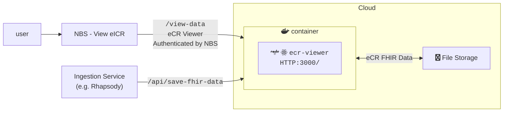
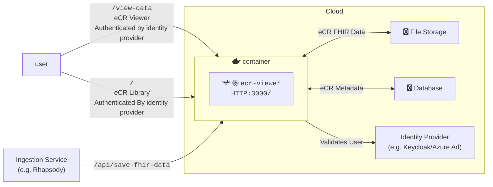
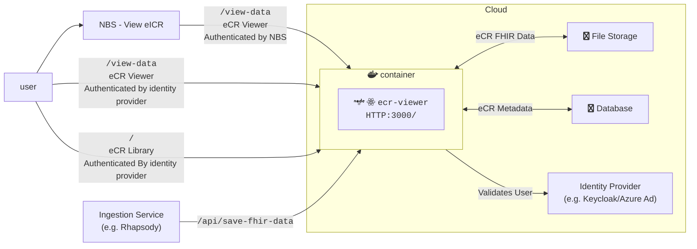

# eCR Viewer Setup Guide

## General Background

The eCR Viewer can be run in three modes.

| Mode             | Features Available | Metadata Support | Authentication Supported                      | Environment Variables Needed                                                                                                                                                                                                        |
| ---------------- | ------------------ | ---------------- | --------------------------------------------- | ----------------------------------------------------------------------------------------------------------------------------------------------------------------------------------------------------------------------------------- |
| `INTEGRATED`     | Viewer             | None             | NBS                                           | [Base](#base-required), [eCR FHIR Storage](#ecr-fhir-storage), [Integrated Authentication](#integrated-authentication)                                                                                                              |
| `NON_INTEGRATED` | Viewer, Library    | SQLSERVER or PG  | External authentication provider              | [Base](#base-required), [eCR FHIR Storage](#ecr-fhir-storage), [Non-Integrated Authentication](#non-integrated-authentication), [Metadata Database](#ecr-metadata-storage)                                                          |
| `DUAL`           | Viewer, Library    | SQLSERVER or PG  | Both NBS and external authentication provider | [Base](#base-required), [eCR FHIR Storage](#ecr-fhir-storage), [Integrated Authentication](#integrated-authentication), [Non-Integrated Authentication](#non-integrated-authentication), [Metadata Database](#ecr-metadata-storage) |

### Integrated Architecture Diagram



### Non-Integrated Architecture Diagram



### Dual Architecture Diagram



## Environment Variable Setup

The full list of environment variables can be found in {@link NodeJS.ProcessEnv}

### Base Required

Base required variables are ones required for all deployments regardless of mode or cloud environment. If variables are not set, this may cause issues starting the app. The variables can be found in {@link EnvironmentVariables.BaseRequired}.

### eCR Fhir Storage

A storage container for the eCRs must be created for all deployments. Depending on the storage container used additional variables may be required. The variables can be found in {@link EnvironmentVariables.EcrStorage}.

### Authentication Setup

Authentication is required when running any mode modes of the application.

#### Integrated Authentication

Integrated eCR Viewer will rely on NBS to authenticate the user. The variables can be found in {@link EnvironmentVariables.Authentication}.

#### Non-Integrated Authentication

Non-Integrated/Dual rely on an external authentication provider, like azure ad, entra, or keycloak. The variables can be found in {@link EnvironmentVariables.Authentication}.

### eCR Metadata Storage

In order to store metadata for the eCR Library, an eCR metadata database must be created. The variables can be found in {@link EnvironmentVariables.EcrMetadataStorage}

### Removed Environment Variables

These are variables that have been retired and no longer have a use in the app. These can be safely removed when installing the current version.

| Name | Description | Version Removed | Date Removed |
| ---- | ----------- | --------------- | ------------ |
|      |             |                 |              |

## Inserting data

### From Rhapsody

Data can be added to the eCR Viewer as a step in Rhapsody.

```js
Placeholder script
```

### From API

Data can be added directly via API requeset to eCR Viewer's /process-zip endpoint.

```bash
curl --location '{URL}/ecr-viewer/api/process-zip' \
--form 'upload_file=@"/path/to/eicr.zip";type=application/zip'
```

## Database Setup

Database setup, migration, and updates are handled at app startup by [Kysely](https://kysely.dev/docs/migrations). There is no need to run any other scripts manually.
