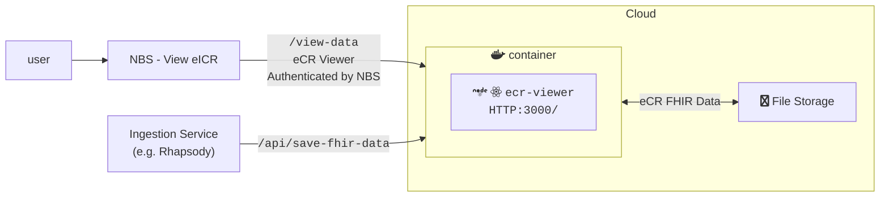
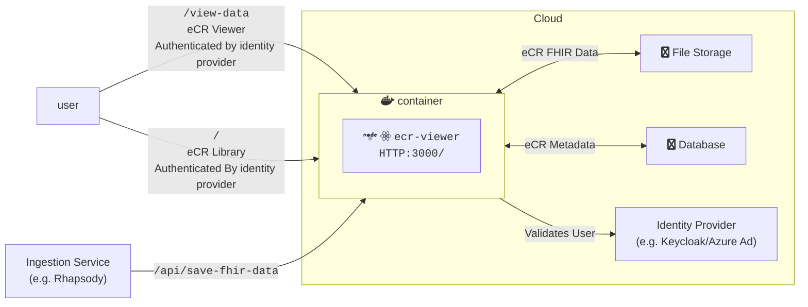
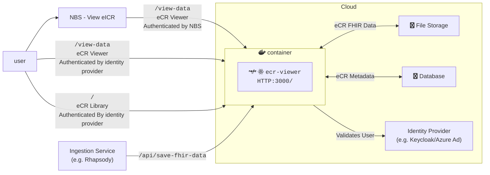

# eCR Viewer Setup Guide

## General Background

The eCR Viewer can be run in three modes.

| MODE             | Features Available | Metadata Support | Authentication Supported                      | Environment Variables Needed                                                                                                                                                                   |
| ---------------- | ------------------ | ---------------- | --------------------------------------------- | ---------------------------------------------------------------------------------------------------------------------------------------------------------------------------------------------- |
| `INTEGRATED`     | Viewer             | None             | NBS                                           | [Base](#base-required), [Integrated Authentication](#integrated-authentication)                                                                                                                |
| `NON_INTEGRATED` | Viewer, Library    | SQLSERVER or PG  | External authentication provider              | [Base](#base-required), [Non Integrated Authentication](#non-integrated-authentication), [Metadata Database](#metadata---ecr-library)                                                          |
| `DUAL`           | Viewer, Library    | SQLSERVER or PG  | Both NBS and external authentication provider | [Base](#base-required), [Integrated Authentication](#integrated-authentication), [Non Integrated Authentication](#non-integrated-authentication), [Metadata Database](#metadata---ecr-library) |

### Integrated Architecture Diagram



### Non Integrated Architecture Diagram



### Dual Architecture Diagram



## Environment Variable Setup

The full list of environment variables can be found in {@link NodeJS.ProcessEnv}

### Base Required

These variables are required for all deployments. If variables are not set, this may cause issues running the app.
{@includeCode ./environment.d.ts#required}

In addition, an storage container for the eCRs must be created. Certain values may need to be set depending on the storage provider used.
{@includeCode ./environment.d.ts#aws}
{@includeCode ./environment.d.ts#azure}
{@includeCode ./environment.d.ts#gcp}

### Authentication Setup

Some form of authentication will be required on the application.

#### Integrated Authentication

Integrated eCR Viewer will rely on NBS to authenticate the user.
{@includeCode ./environment.d.ts#auth_integrated}

#### Non Integrated Authentication

Non-Integrated will relies on an external authentication provider (like azure ad, entra, or keycloak).
{@includeCode ./environment.d.ts#auth_non_integrated}

### Metadata - eCR Library

If using either `NON_INTEGRATED` or `DUAL`, metadata db environments will be required.
{@includeCode ./environment.d.ts#metadata}

### Removed Environment Variables

In order to maintain a history, these are variables that have been retired and no longer have a use in the app.

| Name | Description | Version Removed | Date Removed |
| ---- | ----------- | --------------- | ------------ |
|      |             |                 |              |

## Inserting data

### From Rhapsody

Data can be added to the eCR Viewer as a step in Rhapsody.

```js
Placeholder script
```

### From API

Data can be added directly via API requeset to eCR Viewer's /process-zip endpoint.

```bash
curl --location '{URL}/ecr-viewer/api/process-zip' \
--form 'upload_file=@"/path/to/eicr.zip";type=application/zip'
```

## Database Setup

Database setup, migration, and updates are handled at app startup by [Kysely](https://kysely.dev/docs/migrations). There is no need to run any other scripts manually.
